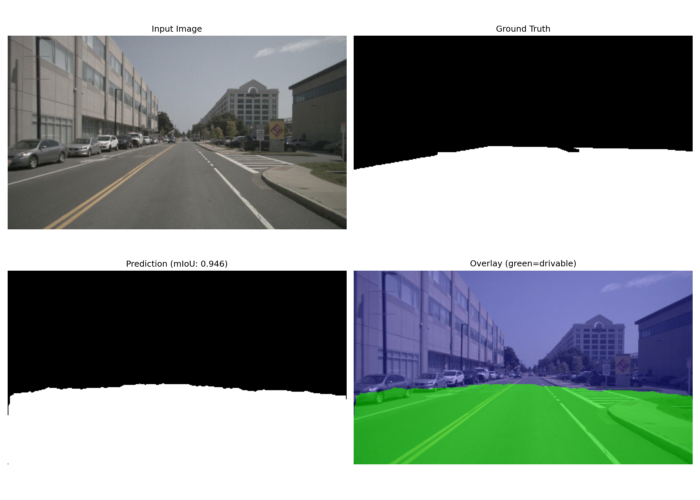
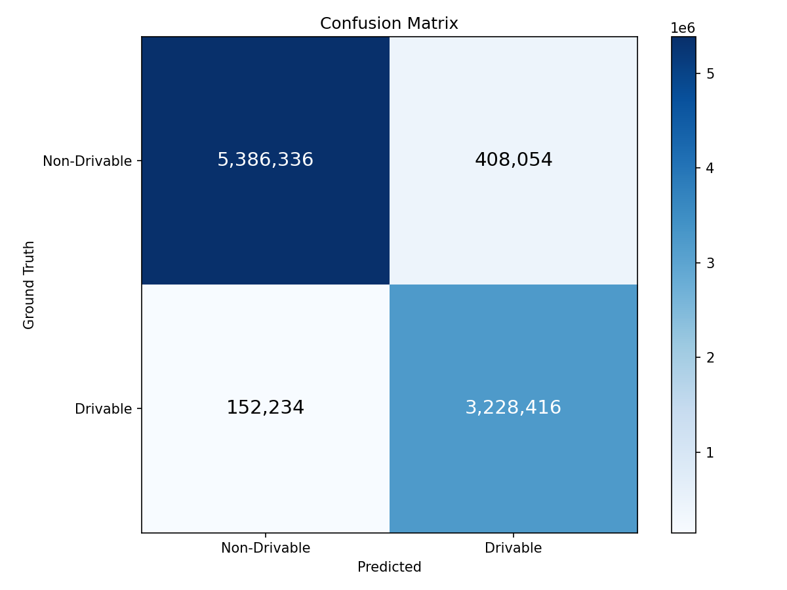

# 🔮 PRISM — Path Recognition with Intelligent Segmentation Model

**Real-time drivable space segmentation for Level 4 autonomous vehicles, built entirely from scratch on nuScenes v1.0-mini.**


---

## 🧠 What is PRISM?

PRISM is a lightweight binary segmentation network that classifies every pixel in a driving camera image as **drivable** or **non-drivable**. It's a critical perception component for autonomous vehicles — the car needs to know *where it can safely drive* in real-time.

**Built 100% from scratch** — zero pre-trained weights, every convolution layer manually implemented.

---

## 🏗️ Architecture

```
        Input (3×256×448)
              │
              ▼
┌──────────────────────────────────┐
│   CoordConv Stem                 │
│   (Injects x,y spatial priors)   │
└──────────────┬───────────────────┘
               │
               ▼
┌──────────────────────────────────┐
│   MobileNetV2 Encoder            │
│   (Inverted Residual Blocks)     │
│   Depthwise Separable Convs      │
│   ──skip@1/4── ──skip@1/8──      │
└──────────────┬───────────────────┘
               │
               ▼
┌──────────────────────────────────┐
│   Reflection Attention Unit (RAU)│
│   Detects water puddles via      │
│   vertical sky-ground correlation│
└──────────────┬───────────────────┘
               │
               ▼
┌──────────────────────────────────┐
│   ASPP Decoder                   │
│   Dilations: 6, 12, 18           │
│   + Global Average Pooling       │
│   Multi-scale context capture    │
└──────────────┬───────────────────┘
               │
               ▼
┌──────────────────────────────────┐
│   U-Net Decoder with SE Attention│
│   1/16 → 1/8 (+ skip_8x)         │
│   1/8  → 1/4 (+ skip_4x)         │
│   Channel Recalibration (SE)     │
│   1/4  → Full (bilinear up)      │
└──────────────┬───────────────────┘
               │
               ▼
┌──────────────────────────────────┐
│   Segmentation Head              │
│   Conv3×3 → Conv1×1 → Sigmoid    │
│   Output: 1×256×448 (binary)     │
└──────────────────────────────────┘
```

**Model Specs:**

| Metric | Student | Teacher |
|---|---|---|
| Parameters | **1.96M** ✓ | ~5.00M |
| Input Resolution | 256 × 448 | 256 × 448 |
| Output | Binary mask | Binary mask |
| FPS Target | ~55 FPS | — |

---

## 📁 Project Structure

```
PRISM/
├── model.py              # LiteSeg architecture (encoder + RAU + ASPP + decoder + SE)
├── dataset.py            # PyTorch Dataset with albumentations augmentations
├── train.py              # Training pipeline (AdamW + CosineAnnealingLR)
├── evaluate.py           # Evaluation: mIoU, confusion matrix, visualizations
├── inference.py          # Inference + ONNX export + quantization + demo video
├── utils.py              # Loss functions, metrics, post-processing, TTA
├── generate_masks.py     # Drivable area mask generation from nuScenes (Auto-Calibrated)
├── requirements.txt      # Python dependencies
└── README.md             # This file
```

---

## 🚀 Quick Start

### 1. Clone & Install

```bash
git clone https://github.com/Lokaksha25/PRISM-Path-Recognition-with-Intelligent-Segmentation-Model-.git
cd PRISM-Path-Recognition-with-Intelligent-Segmentation-Model-
pip install -r requirements.txt
```

### 2. Dataset Setup

Download the **nuScenes v1.0-mini** dataset from Google Drive and extract it into the project root:

📁 **[Download Dataset from Google Drive](https://drive.google.com/drive/folders/1g5KgxG0p8-MmTiXkNtCpoYSIkdBQprEm)**

After downloading, extract:
```bash
tar -xzf v1.0-mini.tgz
```

### 3. Generate Drivable Masks

The mask generator now uses an **auto-calibrated coordinate mapping** algorithm that automatically aligns the ego vehicle poses with the nuScenes `semantic_prior` bitmaps to produce highly accurate ground truth masks.

```bash
python generate_masks.py --dataroot ./ --output_dir masks --visualize 5
```

### 4. Train

**Student model (1.96M params):**
```bash
python train.py --dataroot ./ --mask_dir masks --epochs 50 --batch_size 16 --lr 1e-3
```

**Teacher model (~5.00M params) for knowledge distillation:**
```bash
python train.py --epochs 50 --batch_size 16 --train_teacher --save_name teacher_best.pth
```

**Knowledge distillation (teacher → student):**
```bash
python train.py --epochs 50 --distill --teacher_weights output/teacher_best.pth
```

### 5. Evaluate

```bash
python evaluate.py --weights output/best_model.pth --use_tta --use_boundary_refinement
```

### 6. Inference

**Single image:**
```bash
python inference.py --image path/to/image.jpg --weights output/best_model.pth --refine --tta
```

**ONNX export + benchmark:**
```bash
python inference.py --export_onnx --benchmark --quantize --weights output/best_model.pth
```

**Demo video:**
```bash
python inference.py --demo_video --weights output/best_model.pth --dataroot ./
```

---

## 📊 Training Recipe

| Hyperparameter | Value |
|---|---|
| **Optimizer** | AdamW |
| **Learning Rate** | 1e-3 |
| **Weight Decay** | 1e-4 |
| **LR Schedule** | CosineAnnealingLR |
| **Loss Function** | ComboLoss (0.5×BCE + 0.5×Dice) |
| **Batch Size** | 16 (GPU) / 4 (CPU) |
| **Epochs** | 50+ |
| **Input Size** | 256 × 448 |

### Augmentations
- Random horizontal flip
- Random brightness/contrast
- Random gamma correction (night simulation)
- Coarse dropout (occlusion simulation)
- Hue/saturation/value jitter
- Gaussian blur / motion blur
- Gaussian noise
- Normalize with dataset-computed mean/std

---

## 🎯 Edge Cases Handled

| Edge Case | Solution |
|---|---|
| Road-to-grass transitions | Boundary-aware loss weighting |
| Water puddles / reflective surfaces | **Reflection Attention Unit (RAU)** suppresses false sky reflections on road |
| Low contrast / structural uncertainty | **CoordConv Stem** provides spatial priors directly to the network |
| Construction zones | Training on urban construction scene data |
| Night scenes | Gamma augmentation + 3 night scenes in dataset |
| Partial occlusion | Coarse dropout augmentation |

---

## 🏆 Key Differentiators

1. **100% From Scratch** — No pre-trained weights, no `torchvision.models` imports
2. **Advanced Architecture Setup** — Introduces CoordConv, Reflection Attention Units (RAU), and Squeeze-and-Excitation natively for drivable space task.
3. **Auto-Calibrated Mask Generation** — Automatically aligns bitmap maps using ego positions to fix label misalignment.
4. **Boundary Refinement** — Morphological open/close post-processing
5. **Test-Time Augmentation** — Horizontal flip averaging for free mIoU boost
6. **Knowledge Distillation** — 5M teacher → 1.96M student training
7. **ONNX + Quantization** — Dynamic int8 quantization for edge deployment

---

## 📋 Evaluation Metrics

The final trained student model evaluated across the validation set yields the following results:

| Metric | Target | Achieved |
|---|---|---|
| mIoU (overall binary) | > 0.75 | **0.8789** |
| mIoU (drivable class) | > 0.72 | **0.8521** |
| mIoU (non-drivable class) | - | **0.9058** |
| Inference FPS | > 30 | **~54.79** |
| Mean Latency | - | **18.25 ms** |
| Model parameters | < 3M | **1.96 M** |

### Per-Scene Highlights

* **Best Performing Scene:** `scene-1100` with **0.9306** mIoU
* **Most Challenging Scene:** `scene-0061` with **0.7638** mIoU

### Visualizations

Here is a glimpse of the model's predictions:

**Daytime Scene:**  


**Nighttime Scene:**  


**Confusion Matrix:**  


---

## 🔧 Dataset

**nuScenes v1.0-mini** — 10 scenes, 404 CAM_FRONT keyframes at 1600×900 resolution from Singapore and Boston.

| Property | Value |
|---|---|
| Scenes | 10 (7 day + 3 night) |
| Keyframes | 404 |
| Resolution | 1600 × 900 → 448 × 256 |
| Locations | Singapore, Boston |

---

## 📈 TensorBoard

```bash
tensorboard --logdir runs
```

Tracks: training/validation loss, mIoU, learning rate, FPS.

---

## 🛠️ Tech Stack

- **PyTorch** — Model, training, inference
- **Albumentations** — Image augmentations
- **OpenCV** — Image processing, mask auto-calibration
- **ONNX / ONNX Runtime** — Model export and optimized inference
- **TensorBoard** — Training visualization
- **nuScenes devkit** — Dataset utilities

---

*Built for MAHE Hackathon*
