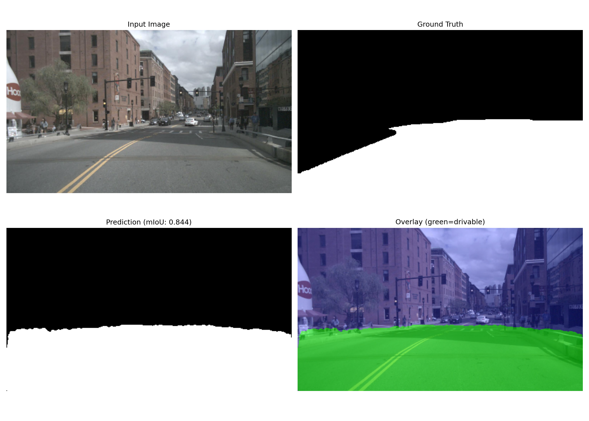
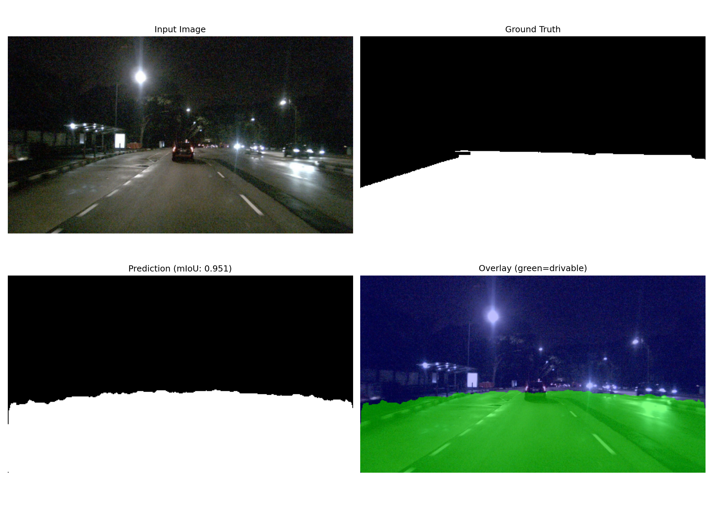

# 🔮 PRISM — Path Recognition with Intelligent Segmentation Model

**Real-time drivable space segmentation for Level 4 autonomous vehicles, built entirely from scratch on nuScenes v1.0-mini.**


---

## 🧠 What is PRISM?

PRISM is a lightweight binary segmentation network that classifies every pixel in a driving camera image as **drivable** or **non-drivable**. It's a critical perception component for autonomous vehicles — the car needs to know *where it can safely drive* in real-time.

**Built 100% from scratch** — zero pre-trained weights, every convolution layer manually implemented.

---

## 🏗️ Architecture

```
        Input (3×256×448)
              │
              ▼
┌──────────────────────────────────┐
│   CoordConv Stem                 │
│   (Injects x,y spatial priors)   │
└──────────────┬───────────────────┘
               │
               ▼
┌──────────────────────────────────┐
│   MobileNetV2 Encoder            │
│   (Inverted Residual Blocks)     │
│   Depthwise Separable Convs      │
│   ──skip@1/4── ──skip@1/8──      │
└──────────────┬───────────────────┘
               │
               ▼
┌──────────────────────────────────┐
│   Reflection Attention Unit (RAU)│
│   Detects water puddles via      │
│   vertical sky-ground correlation│
└──────────────┬───────────────────┘
               │
               ▼
┌──────────────────────────────────┐
│   ASPP Decoder                   │
│   Dilations: 6, 12, 18           │
│   + Global Average Pooling       │
│   Multi-scale context capture    │
└──────────────┬───────────────────┘
               │
               ▼
┌──────────────────────────────────┐
│   U-Net Decoder with SE Attention│
│   1/16 → 1/8 (+ skip_8x)         │
│   1/8  → 1/4 (+ skip_4x)         │
│   Channel Recalibration (SE)     │
│   1/4  → Full (bilinear up)      │
└──────────────┬───────────────────┘
               │
               ▼
┌──────────────────────────────────┐
│   Segmentation Head              │
│   Conv3×3 → Conv1×1 → Sigmoid    │
│   Output: 1×256×448 (binary)     │
├──────────────────────────────────┤
│   Auxiliary Boundary Head        │
│   Explicit edge supervision      │
└──────────────────────────────────┘
```

**Model Specs:**

| Metric | Student | Teacher |
|---|---|---|
| Parameters | **1.97M** ✓ | ~5.00M |
| Input Resolution | 256 × 448 | 256 × 448 |
| Output | Binary mask + Boundary | Binary mask + Boundary |
| Inference FPS (GPU) | **182.7** | — |
| Mean Latency | **5.47 ms** | — |

---

## 📁 Project Structure

```
PRISM/
├── model.py              # LiteSeg architecture (encoder + RAU + ASPP + decoder + SE)
├── dataset.py            # PyTorch Dataset with albumentations augmentations
├── train.py              # Training pipeline (AdamW + OneCycleLR + PRISMLossV2)
├── evaluate.py           # Evaluation: mIoU, confusion matrix, FPR analysis, visualizations
├── inference.py          # Inference + ONNX export + quantization + demo video
├── utils.py              # Loss functions (PRISMLossV2), metrics, post-processing, TTA
├── generate_masks.py     # Drivable area mask generation from nuScenes (Auto-Calibrated)
├── requirements.txt      # Python dependencies
├── OUTPUT_ZIP/           # Final evaluation outputs (confusion matrix, demo video, samples)
└── README.md             # This file
```

---

## 🚀 Quick Start

### 1. Clone & Install

```bash
git clone https://github.com/Lokaksha25/PRISM-Path-Recognition-with-Intelligent-Segmentation-Model-.git
cd PRISM-Path-Recognition-with-Intelligent-Segmentation-Model-
pip install -r requirements.txt
```

### 2. Dataset Setup

Download the **nuScenes v1.0-mini** dataset from Google Drive and extract it into the project root:

📁 **[Download Dataset from Google Drive](https://drive.google.com/drive/folders/1g5KgxG0p8-MmTiXkNtCpoYSIkdBQprEm)**

After downloading, extract:
```bash
tar -xzf v1.0-mini.tgz
```

### 3. Generate Drivable Masks

The mask generator uses an **auto-calibrated coordinate mapping** algorithm that automatically aligns the ego vehicle poses with the nuScenes `semantic_prior` bitmaps to produce highly accurate ground truth masks.

```bash
python generate_masks.py --dataroot ./ --output_dir masks --visualize 5
```

### 4. Train

**Student model (1.97M params) with PRISMLossV2:**
```bash
python train.py --dataroot ./ --mask_dir masks --epochs 50 --batch_size 16 --lr 3e-3 --loss prism
```

**Teacher model (~5.00M params) for knowledge distillation:**
```bash
python train.py --epochs 50 --batch_size 16 --train_teacher --save_name teacher_best.pth
```

**Knowledge distillation (teacher → student):**
```bash
python train.py --epochs 50 --distill --teacher_weights output/teacher_best.pth
```

### 5. Evaluate

```bash
python evaluate.py --weights output/best_model.pth --use_tta --use_boundary_refinement
```

### 6. Inference

**Single image:**
```bash
python inference.py --image path/to/image.jpg --weights output/best_model.pth --refine --tta
```

**ONNX export + benchmark:**
```bash
python inference.py --export_onnx --benchmark --quantize --weights output/best_model.pth
```

**Demo video:**
```bash
python inference.py --demo_video --weights output/best_model.pth --dataroot ./
```

---

## 📊 Evaluation Results

The final trained student model evaluated across the validation set:

| Metric | Value | Target | Status |
|---|---|---|---|
| **mIoU (overall binary)** | **0.8772** | > 0.75 | ✅ Exceeded |
| **mIoU (drivable class)** | **0.8500** | > 0.72 | ✅ Exceeded |
| **mIoU (non-drivable)** | **0.9044** | — | ✅ |
| **Precision** | **0.8868** | > 0.80 | ✅ Exceeded |
| **Recall** | **0.9534** | > 0.70 | ✅ Exceeded |
| **False Positive Rate (FPR)** | **0.0710** | < 0.10 | ✅ Met |
| **F1 Score** | **0.9189** | > 0.75 | ✅ Exceeded |
| **Inference FPS (CUDA)** | **182.7** | > 30 (CPU) | ✅ Exceeded |
| **Mean Latency** | **5.47 ms** | — | ✅ |
| **Model Parameters** | **1,967,179** | < 3M | ✅ Met |

> **TTA Enabled:** False &nbsp;|&nbsp; **Boundary Refinement:** False  
> _Results shown are raw model output without any post-processing._

### Visualizations

**Daytime Scene** (mIoU: 0.844):  


**Nighttime Scene** (mIoU: 0.951):  


**Confusion Matrix:**  


**Demo Video:**  
The `OUTPUT_ZIP/demo_video.mp4` shows the model's real-time inference on sequential driving scenes with overlay visualization.

---

## 📊 Training Recipe

| Hyperparameter | Value |
|---|---|
| **Optimizer** | AdamW |
| **Peak Learning Rate** | 3e-3 |
| **Weight Decay** | 5e-4 |
| **LR Schedule** | OneCycleLR (35% warmup) |
| **Loss Function** | PRISMLossV2 (Focal + Tversky + Multi-Scale Boundary + Spatial Prior) |
| **Batch Size** | 16 (GPU) / 4 (CPU) |
| **Gradient Accumulation** | Configurable (default: 1) |
| **Epochs** | 50+ |
| **Input Size** | 256 × 448 |
| **Early Stopping** | Patience = 10 epochs |

### PRISMLossV2 Components

| Component | Weight | Purpose |
|---|---|---|
| **Focal Loss** (α=0.75, γ=2.0) | 0.30 | Hard pixel mining, class imbalance |
| **Tversky Loss** (α=0.3, β=0.7) | 0.40 | False positive suppression (buildings/sky → road) |
| **Multi-Scale Boundary Loss** (k=3,5,9) | 0.15 | Crisp edge predictions at multiple scales |
| **Spatial Prior Loss** (sky=35%) | 0.15 | Penalizes drivable predictions in sky region |
| **Boundary Head Loss** | 0.10 | Auxiliary edge supervision via dedicated head |

### Augmentations
- Random horizontal flip
- Random brightness/contrast
- Random gamma correction (night simulation)
- Coarse dropout (occlusion simulation)
- Hue/saturation/value jitter
- Gaussian blur / motion blur
- Gaussian noise
- Normalize with dataset-computed mean/std

---

## 🎯 Edge Cases Handled

| Edge Case | Solution |
|---|---|
| Road-to-grass transitions | Multi-scale boundary loss + boundary head |
| Water puddles / reflective surfaces | **Reflection Attention Unit (RAU)** suppresses false sky reflections on road |
| Low contrast / structural uncertainty | **CoordConv Stem** provides spatial priors directly to the network |
| Buildings/sky segmented as road | **Tversky Loss** (α=0.3) heavily penalizes FPs + **Spatial Prior Loss** |
| Construction zones | Training on urban construction scene data |
| Night scenes | Gamma augmentation + 3 night scenes in dataset |
| Partial occlusion | Coarse dropout augmentation |

---

## 🏆 Key Differentiators

1. **100% From Scratch** — No pre-trained weights, no `torchvision.models` imports
2. **PRISMLossV2** — Custom 5-component loss function: Focal + Tversky + Multi-Scale Boundary + Spatial Prior + Boundary Head, specifically designed for false-positive-aware drivable space segmentation
3. **Reflection Attention Unit (RAU)** — Novel attention mechanism detecting water puddles via sky-ground vertical correlation with gated residual design (safe for from-scratch training)
4. **CoordConv Stem** — Injects (x, y) positional channels, giving the model spatial awareness without pretrained features
5. **Squeeze-and-Excitation Decoder** — Channel recalibration attention in U-Net decoder blocks
6. **Auxiliary Boundary Head** — Dedicated head for explicit boundary supervision, producing sharper edges
7. **Auto-Calibrated Mask Generation** — Automatically aligns bitmap maps using ego positions to fix label misalignment
8. **False-Positive-Aware Metrics** — Tracks Precision, Recall, FPR, and F1 alongside mIoU throughout training
9. **OneCycleLR with 35% Warmup** — Stabilized from-scratch convergence
10. **Knowledge Distillation** — 5M teacher → 1.97M student training pipeline
11. **ONNX + Quantization** — Dynamic int8 quantization for edge deployment
12. **Test-Time Augmentation** — Horizontal flip averaging for free mIoU boost

---

## 🔧 Dataset

**nuScenes v1.0-mini** — 10 scenes, 404 CAM_FRONT keyframes at 1600×900 resolution from Singapore and Boston.

| Property | Value |
|---|---|
| Scenes | 10 (7 day + 3 night) |
| Keyframes | 404 |
| Resolution | 1600 × 900 → 448 × 256 |
| Locations | Singapore, Boston |

---

## 📈 TensorBoard

```bash
tensorboard --logdir runs
```

Tracks: training/validation loss, mIoU, learning rate, FPS, **Precision, Recall, FPR, F1**.

---

## 🛠️ Tech Stack

- **PyTorch** — Model, training, inference
- **Albumentations** — Image augmentations
- **OpenCV** — Image processing, mask auto-calibration, morphological operations
- **ONNX / ONNX Runtime** — Model export and optimized inference
- **TensorBoard** — Training visualization
- **nuScenes devkit** — Dataset utilities
- **scikit-learn** — Confusion matrix computation

---

## 📦 Output ZIP

The `OUTPUT_ZIP/` directory contains the final evaluation deliverables:

```
OUTPUT_ZIP/
├── confusion_matrix.png        # Binary confusion matrix visualization
├── demo_video.mp4              # Real-time inference overlay on driving scenes
└── visualizations/             # Per-sample evaluation visualizations
    ├── eval_sample_00.png      # Input | Ground Truth | Prediction | Overlay
    ├── eval_sample_01.png
    └── ... (10 samples)
```

---

*Built for HackToFuture 4.0 — MAHE Hackathon*
